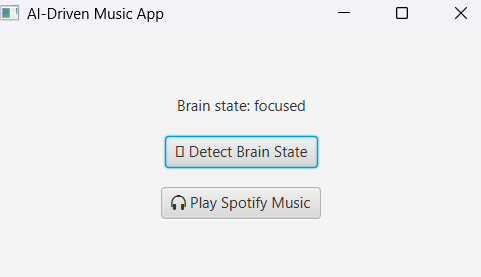

# MindMusic 🎧🧠

MindMusic is a JavaFX-based desktop application that detects your brain state using a simulated API and plays matching music on Spotify. Whether you're focused, relaxed, or stressed, MindMusic curates the perfect vibe for your mind.

## 🧠 Features

- 🧠 Brain State Detection (via Mock API)
- 🎵 Plays Spotify Music Based on State
- ⚙️ JavaFX UI with One-Click Control
- 💡 Smart Mood Detection (relaxed, stressed, focused)

## 🛠️ Technologies Used

- Java 8+
- JavaFX
- Spotify (via web browser)
- Mocky.io (for brain state simulation)
- JSON (org.json)
  
## Demo
  <!-- Optional if you want to upload a GIF/screenshot -->

## How to Run
1. Clone the repo
2. Run `MainApp.java` (ensure JavaFX is configured)
3. Click "Detect Brain State" ➜ Click "Play Spotify Music"

## License
MIT
